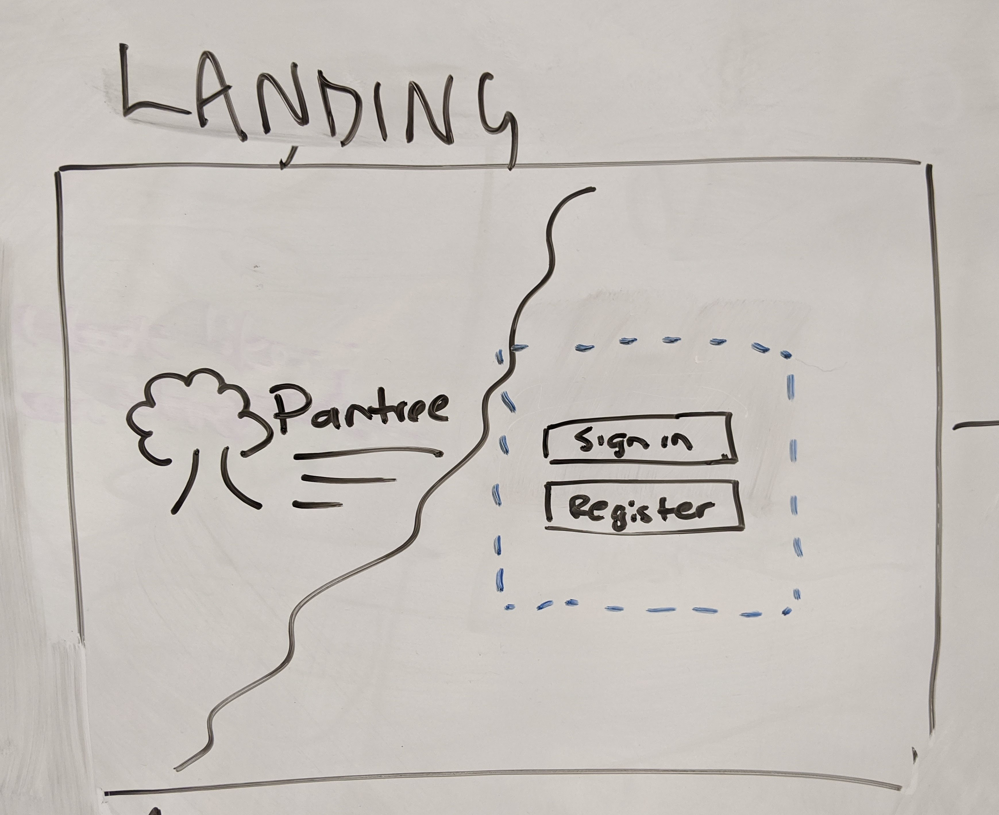
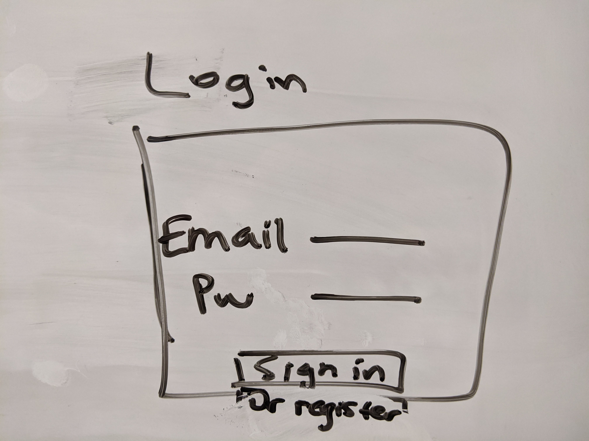
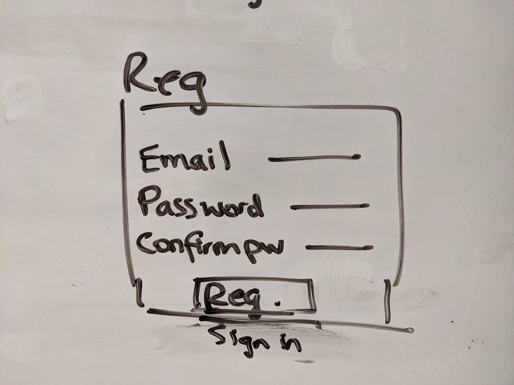
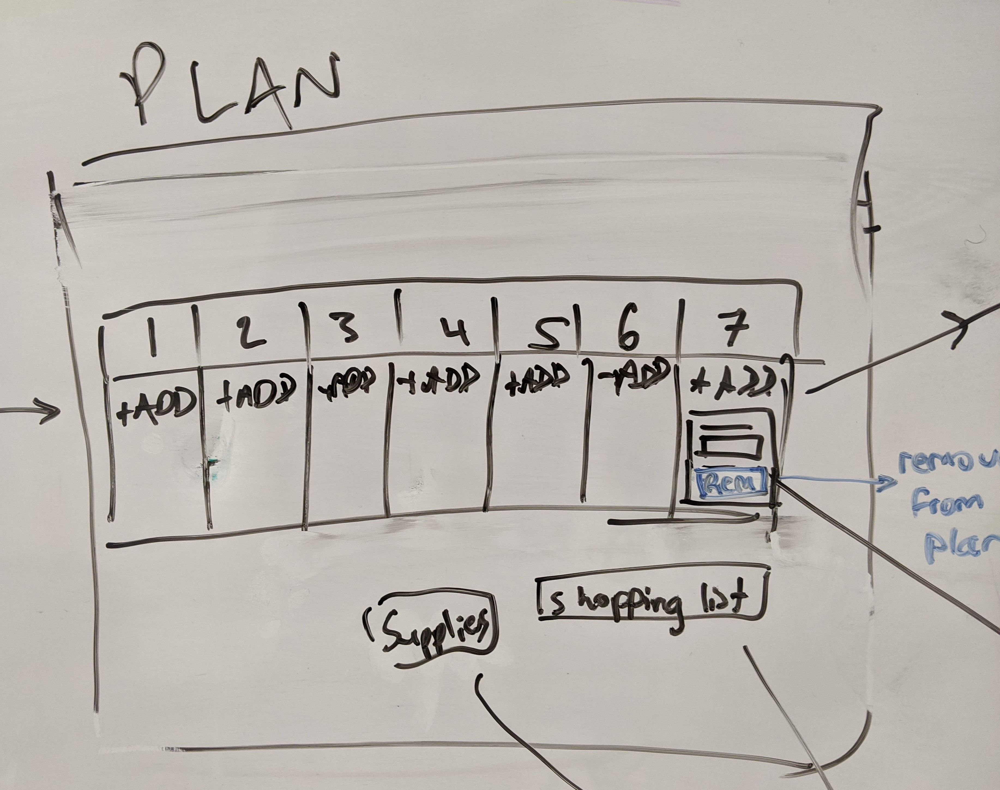
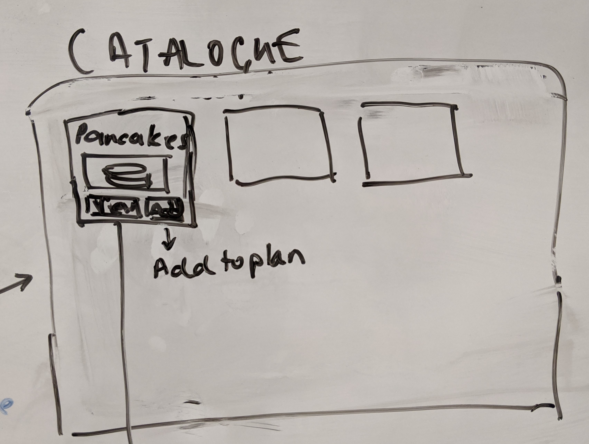
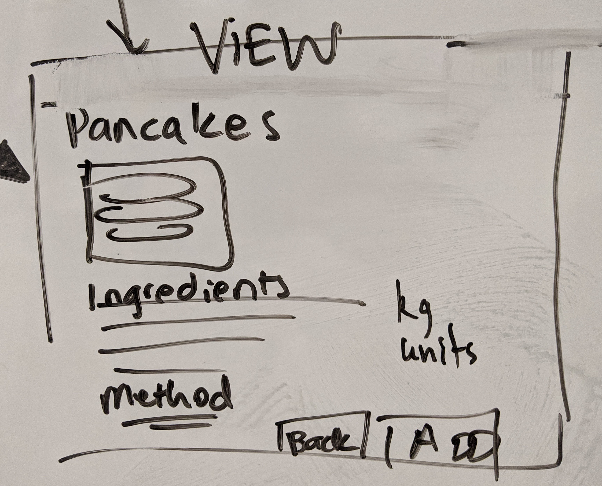
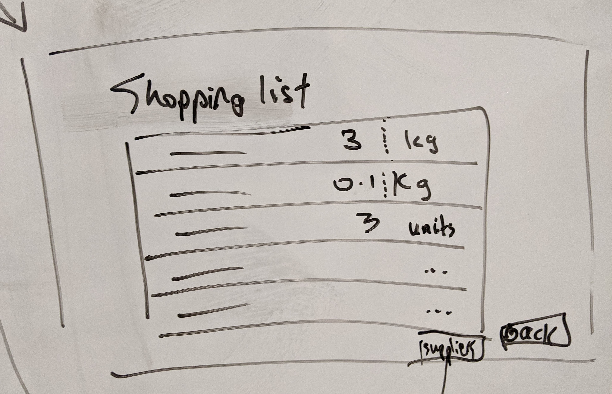
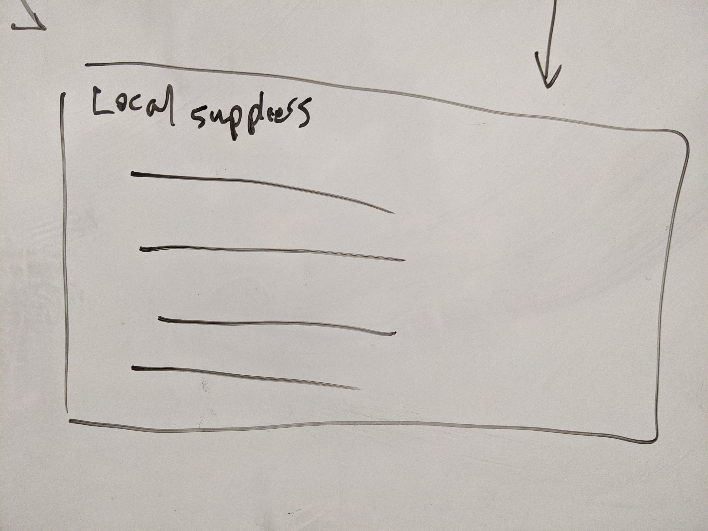

# Pantree

- Trello: https://trello.com/b/m8VRdMO4/plantree
- Heroku: https://pantree-app.herokuapp.com/

## Team Schedule:

*Expected daily meeting:* 9am stand-up

**Fai:** Not after 7pm, Sunday off.      
**BenM:** Not after 6:30, Saturday off.     
**Joe:** Not after 6:30, try not to work on weekend.    
**Jefferson:** Late is fine, Tuesday 21st off.  
**Aisyah:** Not after 7:30, Sunday off.   
**Rose:** Not after 7, can work weekend but need atleast half day off.    

*4pm fun time*       
*Check-in before weekend, get rest and not burn out*

## Stress Profiles:

### Fai      
***Stress Sign:***       
I go silent and become a little withdrawn.    

***What to do:***
Give me space, but keep me up to date with any major changes as they happen.    

### BenM      
***Stress Sign:***       
When I feel stressed my mouth works faster than my brain. My tells are that I bite my fingers and play with my earring.    

***What to do:***
I need someone to check in and tell me to go for a walk.     

### Joe      
***Stress Sign:***       
When I feel stressed I sigh a lot and go kinda quiet.    

***What to do:***
I need someone to check in and tell me to take a breather.    

### Jefferson     
***Stress Sign:***       
I go silence and go for a wander —if I do, I’ll let the team know.    

***What to do:***
If I’m pair up, maybe let me know to take a breath if it’s too obvious.     

### Aisyah      
***Stress Sign:***       
I become quiet and need to disappear and/or go for a walk to decompress on my own.    

***What to do:***
Normally I'd tell my pair/team that I need to take a break/go for a walk but sometimes 
if there's a noticeable drop in energy and change in facial expression I may need a reminder 
to drop whatever I'm doing immediately and retreat/go for a walk.     

### Rose      
***Stress Sign:***       
I become quiet, my typing gets worse than normal and I trial and error lots of things.   

***What to do:***
I need someone to tell me to go for a walk or for someone to take over typing for me.   

## Team Roles:

**P.O.:** Joe
- Customer perspective
- Doubles as the project lead
- SCRUM master
- Keep product ducumentation up to date

**Git Floater:** Fai
- Knowing where everyone is at with the code
- Guiding when conflict arise
- Deals with issues after code is written in GitHub
- Making sure that the person responsible deals with the conflict
- Deployment

**Vibes/Fun checker:** Jefferson
- Be aware of the state of the group and individuals
- Call out when the vibe is not good
- Respond appropriately when someone's vibe drops
- Stop everyone at 4pm to make sure team has some fun

**Teach Lead:** BenM (frontend) / Rose (backend)
- Making sure that everyone follows set conventions
- Leads solve technical problems during the coding process, first port of call, does not need to be the expert
- Keeping technical documentation up to date
- Final call on technical decisions/ approaches/ standardization

**Co-helper:** Aisyah
- Float
- Pitch in when needed/available

## Git Branching Strategy:
- Master = deploy
- Development = pull, fetch
- 'branch_name' = feature currently working on
- All members to solve own conflict if able
- Branch creater deletes the branch once feature is finished
- Talk to Git master if there is a problem
- Let Git master know once code has be reviewed
- Git master to merge major feature

# User stories

## MVP

As a user, I want:

- I want a landing page so that I can be introduced to Pantree and sign in or register
- I want to be able to sign in from the landing page so that I can start making a meal plan
- I want to be able to register from the landing page, so that I can start using Pantree
- A 'My plan' page, so that I can review my meal plan for the week. Days are numbered 1-7. Meals are listed by number, and I can add an indefinite number of meals to each day
- To add a recipe from the Pantree recipe catalogue to my plan, on the day I selected from My plan page
- A 'Recipes' page, to see what recipes are available for Pantree's catalogue for me to choose from. Each recipe should have a name, image, View and Add button
- To remove a recipe from my plan
- To view more details about a recipe from the recipe catalogue, so that I can see what ingredients are needed and how to make it. Each recipe makes 1 portion and assumes no leftovers
- To go back to the recipe catalogue if I choose not to add a recipe from View mode
- To view my shopping list, so I can see the total ingredients required for my entire weekly plan
- To see a list of local suppliers with fresh, sustainable produce
- A nav bar on all screens except the landing page, so that I can navigate between My plan, Shopping list, Local suppliers, or Log out

## Stretch

As a user, I want:

- To be able to manually enter recipes to my own recipe catalogue, so I'm not limited by only Pantree's recipe catalogue
- To be able to add recipes by URL using screenscraping, so I can manually add recipes from the internet
- The ability to save a meal plan with a name, so that I can use it again in future if I liked it
- The option to sort my shopping list by category, so I have an easier time when I go shopping for the ingredients
- To be able to drag and drop recipes on my plan, so I can shuffle things around easily
- To be able to clone recipes on my plan, so it's easy for me to plan out multiple days with the same recipe
- To have my recipe units converted into something much easier
- The ability to save a list of items I have in my pantry already, so I can remove them from my shopping list
- Pantree to compare my total recipe list with what's already in my pantry, so I don't have ingredients already in my pantry in my final shopping list
- Pantree to suggest wine pairings with my meals and the option to add the wine to my shopping cart
- Pantree to suggest places where I can get my sustainably sourced produce
- To export my shopping list to another tool of my choice (eg. google shopping list, trello, etc.)

## Wireframes

### Landing page



### Landing page - sign in component



### Landing page - register component



### My plan page



### Pantree recipe catalogue



### Recipe view



### Shopping list



### Local supplier list



## DB (Server Side)

### recipes
  | Column Name | Data Type |
  | --- | --- |
  | id | Integer |
  | name | String |
  | image | String |
  | method | String |
  
### recipes_ingredients (M2M)

  | Column Name | Data Type |
  | --- | --- |
  | id | Integer |
  | quantity | Interger |
  | recipe_id | Interger |
  | ingredient_id | Interger |

### ingredients

  Many Users attend Many Meetings

 | Column Name | Data Type |
 | --- | --- |
 | id | Integer |
 | name | String |
 | unit | String |
 
### users

 | Column Name | Data Type |
 | --- | --- |
 | id | Integer |
 | email | String |
 | hash | String |

### plans (1 to many)

 | Column Name | Data Type |
 | --- | --- |
 | id | Integer |
 | user_id | Interger |
 | name | String |

### plans_recipes (M2M)

 | Column Name | Data Type |
 | --- | --- |
 | plan_id | Integer |
 | day_number | Interger |
 | recipe_id | Interger |
 
--------

## Frontend

### Global State

***Reducers***

```js
{
  plan:
  selectedDay: 1,
  loading: false,
  auth: 
  recipes: [...],
  message: "...",
  shoppingList: [{...}]
}
```

### Local States

***Reducers***

```js
{
  slectedRecipe: // id
  recipes: // all
  shoppingList: // result
}
```

## API Endpoints

### GET plan by id

***GET*** /plans/:planId

Response Body:
```JSON
{ 
  "days": [
    { 
      "dayNumber": 1,
      "recipes": [
        { 
          "recipeId": 1,
          "recipeName": "pancake"
        },
        {
          "recipeId": 2,
          "recipeName": "stew",
        }
      ],
      "dayNumber": 2,
      "recipes": [{"..."}, {"..."}]
    }
  ]
}
```

### GET recipes

***GET*** /recipes

Response Body:
```JSON
[
  {
    "recipeId": 1,
    "recipeName": "pancake",
    "image": "images/1.jpg"
  },
  {
    "recipeId": 2,
    "recipeName": "stew",
    "image": "images/2.jpg"
  },
]
```

### GET recipe by recipe id

***GET*** /recipes/:recipeId

Response Body:
```JSON
{
  "recipeId": 1,
  "recipeName": "pancake",
  "image": "images/1.jpg",
  "method": [],
  "ingredients": [
    {
      "ingredientName": "carrot",
      "quantity": 5,
      "unit": "each"
    }
  ] 
}
```

### Get shopping list

***Get*** /shopping-list/:planId

Response Body:
```JSON
[
  {
    "ingredientName": "carrot",
    "quantity": 5,
    "unit": "each"
  },
  {
    "ingredientName": "flour",
    "quantity": 2.5,
    "unit": "kg"
  }
]
```

***POST*** /plans/

Request Body:
```js
{
  // userId: 2,
}
```

Response Body:
```js
{
  // planId: 12,
}
```

***PATCH*** /plans/:planId

Request Body:
```js
{
  // same content as GET /plans/:planId
}
```

Response Body:
```js
{
  // status 200
}
```

## Flow plan

### URL

Landing = '/'   
- once signed in redirect to plan

Plan = '/plan'     
- redirects to recipe, view, shopping list and suppliers

Recipes = '/recipes'    
- redirects to view of item clicked
- button to go back to plan

View = 'recipe/:recipeId'     
- if 'add' or 'back' is clicked then redirects back to recipes

Shopping List = '/shopping-list'    

Local Suppliers = '/supplier'      

### Views (Client Side)
  | name | purpose |
  | --- | --- |
  | Nav | Nav bar for all pages except the landing page |
  | Landing | Landing page component allowing a user to sign in or register |
  | LandingAbout | Logo and description of Pantree, shown on the landing page |
  | SignIn | Shown on landing page by default, allowing an existing user to sign in |
  | Register | Alternative component allowing a new user to register, shown conditionally instead of SignIn |
  | Plan | The main plan table, parent component |
  | PlanColumn | Child of Plan, represents recipes entered for a single day |
  | PlanRecipeCard | Child of PlanColumn, represents a single recipe entry |
  | Recipes | Recipes page |
  | RecipeThumbnail | Child of Recipes, a card showing basic details about a recipe stored in the Pantree recipe book |
  | RecipeView | A page showing a detailed view of a recipe |
  | ShoppingList | A page showing a users shopping list, based on their meal plan |
  | Suppliers | A page showing a list of local suppliers with sustainably sourced produce |

 ## Actions

 ### plan

 | type | data | purpose |
 | --- | --- | --- |
 | GET_PLAN | plan | retreive plan from the db and store in redux, set loading : true |
 | SET_PLAN | plan | save plan to store |
 | SAVE_PLAN | plan | save plan to db |
 | ADD_PLAN | recipe/day | add selected recipe/day from globalState |
 | REMOVE_PLAN | recipe/day | remove selected recipe/day from globalState |

 ### loading
 | type | data | purpose |
 | --- | --- | --- |
 | LOADING | boolean | show loadng anmation for async |
 
 ### selected day
 | type | data | purpose |
 | --- | --- | --- |
 | SET_DAY | selected_day | set specific day to add recipe to |
 
  ### recipes
 | type | data | purpose |
 | --- | --- | --- |
 | GET_RECIPES | recipe | retreive recipes from db and store in redux |
 | SET_RECIPES | recipe | save recipes to store |
 | SAVE_RECIPES | recipe | save recipes to db |
 
 ### recipe
 | type | data | purpose |
 | --- | --- | --- |
 | GET_RECIPE | recipeId | retreive recipe from db and store in redux |
 | SET_RECIPE | recipeId | save recipe to store |

### shopping list
 | type | data | purpose |
 | --- | --- | --- |
 | GET_LIST | planId | retreive recipe from db and store in redux |
 | SET_LIST | shoppingList | save recipe to store |
